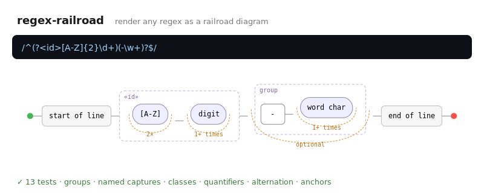

# regex-railroad

[](https://github.com/JCreatesGH/regex-railroad/actions)
[](https://www.typescriptlang.org/)
[](LICENSE)

Make regexes readable. `regex-railroad` parses a regular expression into an AST and renders it as an SVG **railroad diagram** — the format that actually shows what a pattern matches.



## Install

```bash
npm install regex-railroad
```

## Use it

```ts
import { parse, renderRailroad, regexToSvg } from "regex-railroad";

const svg = regexToSvg("^(?<id>[A-Z]{2}\\d+)(-\\w+)?$");
// or work with the AST directly:
const ast = parse("\\d{3}-\\d{4}");
const diagram = renderRailroad(ast);
```

## Supported syntax

- **Literals** and escapes; `.` (any char)
- **Classes** `\d \w \s` and negations, plus `[a-z]` / `[^...]` character sets
- **Anchors** `^ $ \b \B`
- **Groups** — capturing `(…)`, non-capturing `(?:…)`, named `(?<name>…)`
- **Alternation** `a|b|c`
- **Quantifiers** `* + ?`, `{m}`, `{m,}`, `{m,n}`, including lazy (`+?`)

## How it draws

The renderer lays sequences left→right, stacks alternation branches vertically, wraps groups in a dashed box (with the capture name), and draws quantifiers as a loop-back arrow annotated with a human label ("1+ times", "optional", "2–4×"). Output is a self-contained SVG — no canvas, no runtime deps.

## Development

```bash
npm install && npm test    # 13 tests (parser + renderer)
npm run build              # tsc, clean
```

## License

MIT
